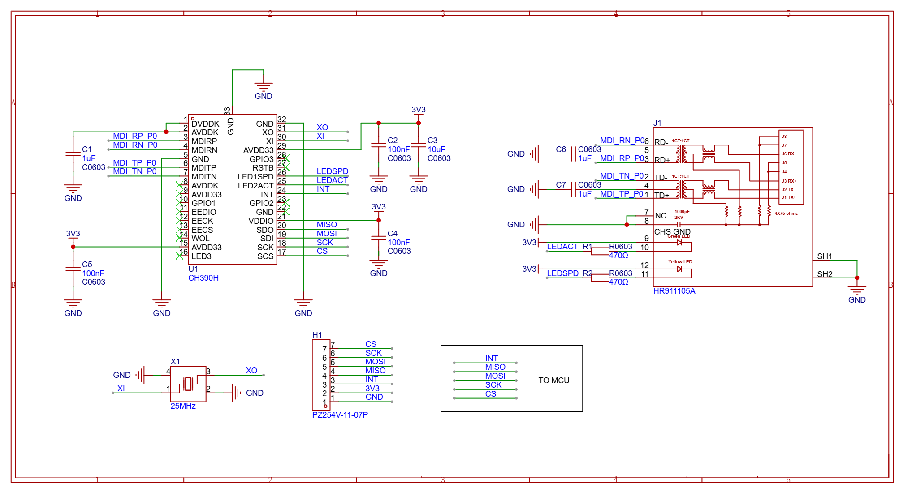

# CH390H SPI to Ethernet Controller Module

Compact **10/100 Mbps Ethernet** expansion for microcontrollers over **SPI**. This repository contains the module documentation, schematic, PCB artwork, interactive BOM, and an ESP32-S3 example firmware.

<p align="center">
  
</p>

The hardware is supplied as an **unassembled bare PCB**. You source and solder the CH390H controller, 25 MHz crystal, RJ45 with magnetics, passives, LEDs, and SPI header yourself. It is intended for electronics enthusiasts, embedded developers, and students who want a DIY SPI Ethernet interface.

## Key features

- WCH **CH390H** industrial Ethernet controller (MAC + PHY)
- **SPI** host interface to an external MCU
- **10/100 Mbps** Ethernet, IEEE 802.3u class PHY
- Standard **RJ45** with integrated magnetics
- **25 MHz** crystal oscillator
- Dedicated **INT** interrupt output
- Onboard Ethernet link/activity LEDs
- **3.3 V** logic, compact PCB, labeled 7-pin SPI header
- Works with **Arduino, STM32, ESP32**, and other SPI-capable MCUs
- No external Ethernet PHY is required when the module is fully assembled

## Technical specifications

| Specification | Detail |
| --- | --- |
| Ethernet controller | CH390H (QFN) |
| Host interface | SPI + interrupt |
| Ethernet speed | 10/100 Mbps |
| Supply / logic | 3.3 V |
| Crystal | 25 MHz |
| Ethernet connector | RJ45 with integrated magnetics |
| MCU header | 7-pin, 2.54 mm |
| Status indicators | Ethernet link/activity LEDs |
| Application | MCU Ethernet expansion |

Electrical limits, SPI timing, and supported Ethernet modes must be taken from the [CH390H datasheet](https://www.wch.cn/downloads/CH390DS1_PDF.html) for the chip revision you use.

## SPI interface

The module uses a 7-pin header for a direct MCU connection:

| Pin | Function | Description |
| --- | --- | --- |
| CS | Chip Select | SPI chip-select input |
| SCK | SPI Clock | SPI clock |
| MOSI | SPI MOSI | MCU → CH390H data |
| MISO | SPI MISO | CH390H → MCU data |
| INT | Interrupt | Ethernet controller interrupt output |
| 3V3 | Power | 3.3 V supply |
| GND | Ground | Power and signal ground |

### Typical MCU connection

| CH390H module | MCU |
| --- | --- |
| CS | SPI CS |
| SCK | SPI SCK |
| MOSI | SPI MOSI |
| MISO | SPI MISO |
| INT | GPIO / interrupt input |
| 3V3 | 3.3 V |
| GND | GND |

CS, SCK, MOSI, and MISO form the SPI bus. INT can go to an MCU GPIO for interrupt-driven Ethernet events. INT is optional depending on software, but using it is recommended.

```
MCU                         CH390H module                 Network
┌──────────────┐            ┌──────────────┐              ┌────────┐
│          SCK ├───────────►│ SCK          │              │        │
│         MOSI ├───────────►│ MOSI         │   Ethernet   │  RJ45  │
│         MISO │◄───────────┤ MISO         ├─────────────►│        │
│           CS ├───────────►│ CS           │              └────────┘
│          INT │◄───────────┤ INT          │
│          3V3 ├───────────►│ 3V3          │
│          GND ├────────────┤ GND          │
└──────────────┘            └──────────────┘
```

## Ethernet interface

The Ethernet section includes:

- RJ45 connector with integrated transformer/magnetics
- Ethernet differential-pair routing
- Link/activity LEDs
- 75 Ω termination network
- CH390H Ethernet MAC/PHY

Use a standard Ethernet cable to connect the MCU system to a switch, router, PC, or other Ethernet device.

## Schematic and BOM

<p align="center">
  
</p>

- Schematic: [`Module_Schematic.png`](Module_Schematic.png)
- Interactive BOM: [`InteractiveBOM_CH390H Module.html`](InteractiveBOM_CH390H%20Module.html)
- Full write-up: [`Module Specs.odt`](Module%20Specs.odt)

## Onboard components

- CH390H Ethernet controller
- 25 MHz crystal oscillator
- RJ45 with integrated transformer
- Decoupling capacitors and Ethernet termination
- SPI interface header
- Ethernet status LEDs
- 3.3 V power connections

## ESP32 example firmware

`CH390H_ESP32/s3-ch390h` is an ESP-IDF example that brings up the CH390H over SPI, assigns a static Ethernet IP, and includes a TCP server path.

Default SPI pin mapping in `sdkconfig` (ESP32-S3):

| Signal | GPIO |
| --- | --- |
| SCLK | 12 |
| MOSI | 11 |
| MISO | 13 |
| CS | 10 |
| INT | 14 |
| SPI clock | 72 MHz |

Example Ethernet address used by the firmware: **192.168.1.10 / 255.255.255.0**, gateway **192.168.1.1**.

Build with [ESP-IDF](https://docs.espressif.com/projects/esp-idf/en/latest/esp32s3/get-started/index.html) from `CH390H_ESP32/s3-ch390h`:

```bash
idf.py set-target esp32s3
idf.py build
idf.py -p PORT flash monitor
```

Driver usage details are in [`CH390H_ESP32/s3-ch390h/components/ch390/README.md`](CH390H_ESP32/s3-ch390h/components/ch390/README.md). Downloaded IDF components in `managed_components/` are omitted from this repo and will be restored by the IDF Component Manager from `idf_component.yml`.

## Applications

- STM32 / ESP32 / Arduino Ethernet expansion
- Industrial controllers, PLC, and automation
- Embedded web servers and remote monitoring
- IoT gateways and network-connected sensors
- Data acquisition and robotics
- Custom boards that need Ethernet without an on-chip MAC

SPI Ethernet is useful when the MCU has no convenient Ethernet MAC: the host only needs SPI plus one optional interrupt GPIO.

## Package contents

- 1 × CH390H SPI to Ethernet Controller PCB

Ethernet cable and MCU are not included unless specifically stated.

## Notes

- The module requires a **3.3 V** supply. Connect module GND to MCU GND.
- Wire SPI according to the MCU peripheral you use.
- Firmware/library support is required to talk to the CH390H.
- This is an Ethernet **controller module**, not a standalone Ethernet-to-USB adapter.

## Repository layout

```
.
├── README.md
├── Module Specs.odt
├── Module_Schematic.png
├── PCB For CH390H Ethernet Module.jpg
├── InteractiveBOM_CH390H Module.html
└── CH390H_ESP32/s3-ch390h/     ESP-IDF example + CH390 driver
```
